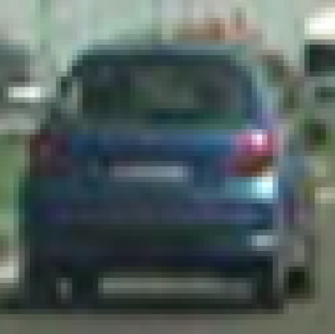
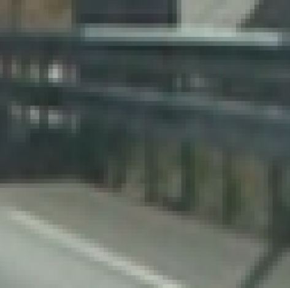
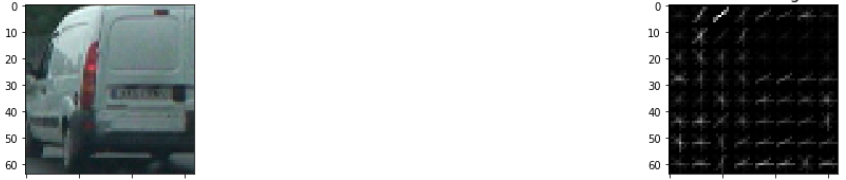
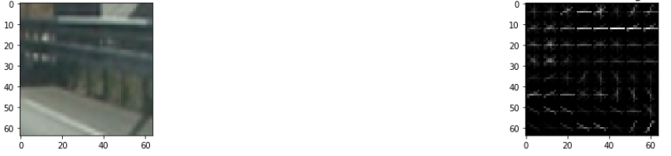
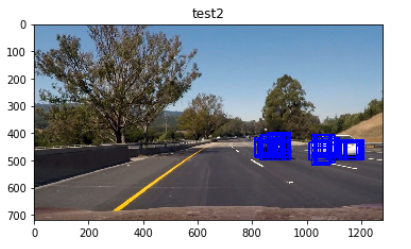
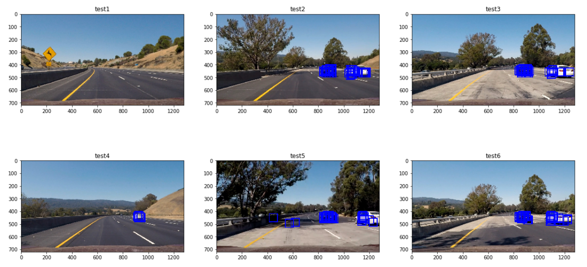
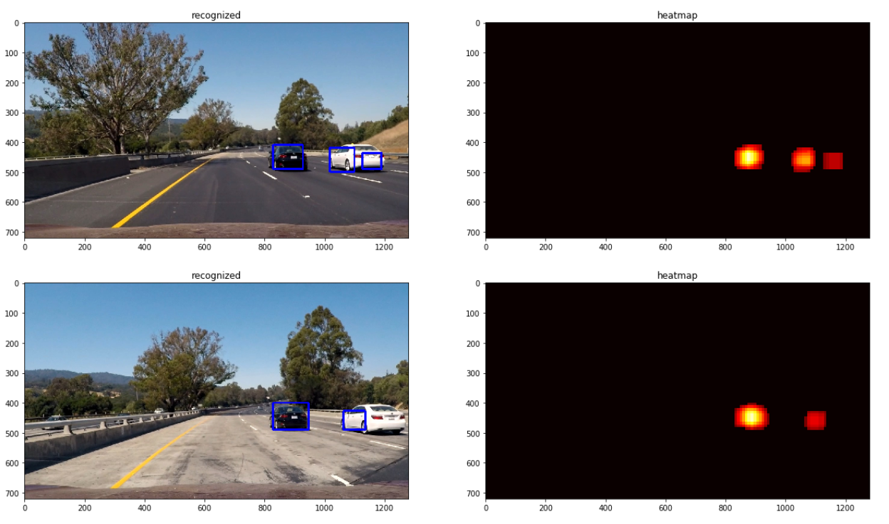
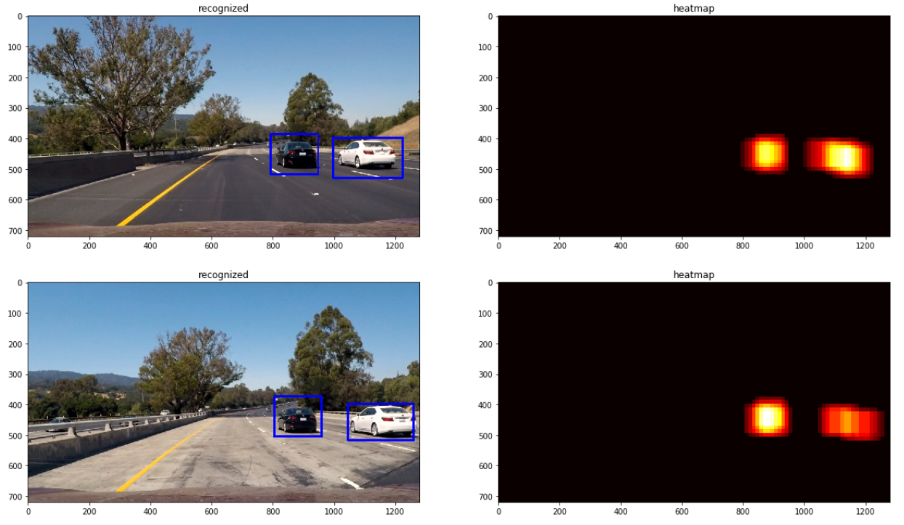

# Udacity_CarND_VehicleDetection
Term1-Project5: Vehicle detection

## Goals

The goals / steps of this project are the following:

* Perform a Histogram of Oriented Gradients (HOG) feature extraction on a labeled training set of images and train a classifier Linear SVM classifier
* Optionally, you can also apply a color transform and append binned color features, as well as histograms of color, to your HOG feature vector.
* Note: for those first two steps don't forget to normalize your features and randomize a selection for training and testing.
* Implement a sliding-window technique and use your trained classifier to search for vehicles in images.
* Run your pipeline on a video stream (start with the test_video.mp4 and later implement on full project_video.mp4) and create a heat map of recurring detections frame by frame to reject outliers and follow detected vehicles.
* Estimate a bounding box for vehicles detected.

## Dataset

The dataset for the project can be obtained here. [vehicle](https://s3.amazonaws.com/udacity-sdc/Vehicle_Tracking/vehicles.zip) and [non-vehicle](https://s3.amazonaws.com/udacity-sdc/Vehicle_Tracking/non-vehicles.zip).

* Num of vehicles =  8792
* Num of non-vehicles =  8968

The __get_dataset()__ method read and loads the dataset as numpy arrays for use. Sample vehicle & non-vehicle images are as shown below.

| Vehicle | Non-vehicle |
|---------|-------------|
|  |  |


## Rubric Points

### Writeup / README

#### 1. Provide a Writeup / README that includes all the rubric points and how you addressed each one. You can submit your writeup as markdown or pdf. Here is a template writeup for this project you can use as a guide and a starting point.

You're reading it!

### Histogram of Oriented Gradients (HOG)

#### 1. Explain how (and identify where in your code) you extracted HOG features from the training images.

The __get_hog_features()__ method implemented in te cell #5 implements the code to extract HOG features for a given image along with required parameters. HOG is used as a feature descriptor for image recognition of objects. It basically counts the occurrences of gradient orientations in a localized portion of a given image.

Here's a sample of HOG features extracted for a sample vehicle & non-vehicle image.

| Vehicle | Non-vehicle |
|---------|-------------|
|  |  |

The HOG features depict distribution of direction of gradients of an image (x, y derivates), which are useful because the magnitude of gradients is larger around corners and edges which contribute a lot more to the information of the objects images than flatter regions.

__get_hog_features()__ internally uses the __hog__ implementation from __Skimgage__ package. This method takes in several prameters and its details are provided below.

#### 2. Explain how you settled on your final choice of HOG parameters.

The SKimage's implementaiton of __hog__ depends on these important params: (__there are few other params, but these are the most important ones__)

1. orientations - corresponds to the number of groups the gradient's directions are grouped into.
2. pixels_per_cell - corresponds to the number of pixesl in each cells
3. cells_per_block - corresponds to the number of cells that make up a single block

HOG features are obtained by dividing the image into blocks which constitues of cells and the gradient of each cell is computed and categorized into one the groups. The orientation parameter defines the number of such groups.

After experimenting with several values during the coursework and the project, the following values turned out to be satifactory.
```python
...
'orient': 8,
'pix_per_cell': 8,
'cell_per_block': 2,
...
```
#### 3. Describe how (and identify where in your code) you trained a classifier using your selected HOG features (and color features if you used them).

Apart from the HOG features described above, I also considered spatial & color histogram features. These three together constitues my feature vector which i used for traning. The __extract_features()__ method implemented in cell #6 of the python notebook extracts these features and return them as array of feature vector. The final set of paramenters used for these feature extraction is as shown below

```python
params = {
            'color_space': 'YCrCb',
            'spatial_size': (16, 16),
            'orient': 8,
            'pix_per_cell': 8,
            'cell_per_block': 2,
            'hog_channel': 'ALL',
            'hist_bins': 32,
            'scale': 1.5,
            'spatial_feat': True, 
            'hist_feat': True, 
            'hog_feat': True,
            'hist_range': (0, 256)
}
```

With these features extracted, I used an SVM to train & build my classifier. Specifically, I used the __LinearSVC__ classifier provided in __Sklearn.svm__ package. This is implemented in cell #8 of the python notebook.

In the implementation, __vehicle_features__ and __non_vehicle_features__ together form __X__ which constitues of different features extractes from vehicles & non_vehicles datasets accordingly. The StandardScaler assumes data is normally distributed within each feature and will scale them such that the distribution is now centred around 0, with a standard deviation of 1. 'x' values are transformed using the function and get the output scaled_X. The vehicles are labeled as 1 and non-vehicles are labelled as 0 and __Y__ is formed accordingly.

The __train_test_split()__ helper function from sklearn package is used to split the dataset into train & test set in 80:20 ratio. Finally, a LinearSVC is trained from x_train & y_train and its performance is tested on the x_test & y_test sets and I obtained the following results for the svc.

```
Training SVM with following params:
orientations = 8
pixels per cell and = 8
cells per block =  2
Feature vector length: 5568
SVC training time =  3.0
Test Accuracy of SVC =  0.9929
```

### Sliding Window search

#### 1. Describe how (and identify where in your code) you implemented a sliding window search. How did you decide what scales to search and how much to overlap windows?

__Sliding Window__ basically corresponds to using a rectangle of fixed width and height as a windows and sliding it across a given image and perofrm some processing in that window region. In our case, we use of trained classifer to detect vehicles in a given window.

The __slide_window()__ method implemented in cell #9 performs this algo. The tricky part of this algo is to identify what is the correct size of the window and how much to overlap the window while sliding across the image. Typically, the window size is determied by the smallest size/region of the image in which we hope to identify the image and the region of overlap is defined based on some level of experimentaion/confidence scores. 

For the purpose of the projects video, we certainly do not hope to find any vehciles in the top 30% of the image as it is always the sky. Thefore we only consider the lower 60% of the image for processing. Since I had no idea of what size of the window & region of overlap would be ideal, i experimented with different vlaues and finally settled to using 64x64 as the window size and 85% of overlap between the windows. This resulted in the following detections.



As seen above, this resulted in a lot of identified boxes for a given image. These multiple detections & false positives were removed later using heat maps as described in the below sections

#### 2. Show some examples of test images to demonstrate how your pipeline is working. What did you do to optimize the performance of your classifier?

Below is the sample of detections performed on the test images that demostrate my pipeline was working satisfactorily. Instead of just HOG features, my implementation also used YCrCb 3-channel HOG features plus spatially binned color and histograms of color in the feature vector, which provided a nice result. Here are some example images:



### Video implementation

#### 1. Provide a link to your final video output. Your pipeline should perform reasonably well on the entire project video (somewhat wobbly or unstable bounding boxes are ok as long as you are identifying the vehicles most of the time with minimal false positives.)

Here the link to my video - [project_video_output.mp4](./project_video_output.mp4)

#### 2. Describe how (and identify where in your code) you implemented some kind of filter for false positives and some method for combining overlapping bounding boxes.

Heatmaps are used here to identify & filter duplicates and false positives. From the positive detections a heatmap is created and then thresholded that map to identify vehicle positions. Adding heat basically corresponds to increating the counter/intensity of the identified pixel over a region of interest. This results in overlapped pixels having higher intensity than other neighbouring pixels. By defining a threshold, we select only those pixels that are beyond the defined threshold limit. these identified pixed provide us the region of the identified object/cars and a bounding box is drawn around that region using OpenCV methods. The __add_heat()__, __apply_threshold()__ and __draw_labeled_bboxes()__ methods implemented in cell #12 performs this logic. Here's the sample of the results performed on the test images.



Apart from this, the hog sub-sampling method, __find_cars_hog_sub()__ implemented in cell #14, is a more efficient method for doing the sliding window approach. The code only has to extract hog features once and then can be sub-sampled to get all of its overlaying windows. Each window is defined by a scaling factor where a scale of 1 would result in a window that's 8 x 8 cells then the overlap of each window is in terms of the cell distance. This means that a cells_per_step = 2 would result in a search window overlap of 75%. Its possible to run this same function multiple times for different scale values to generate multiple-scaled search windows. The hog sub-sampling helps to reduce calculation time for finding HOG features and thus provided higher throughput rate.

With this, the final pipeline to process an image looks like this

```python
def pipeline(img):
    ystart = 350
    ystop = 656
    threshold = 1 
    windows = find_cars_hog_sub(img, ystart, ystop, svc, X_scaler, params)
    draw_img, heat_map = heat_threshold(img, threshold, svc, X_scaler, windows, params)
    
    return draw_img
```
and the final results on the test images are as shown below.



### Discussion

#### 1. Briefly discuss any problems / issues you faced in your implementation of this project. Where will your pipeline likely fail? What could you do to make it more robust?

The immediately notifiable problem with my implementaion is the identification of false negatives, for ex: on the regions of the road and sometimes on the vegetation regions. I used a simple LinerSVC for training, but I guess using a better classifier, for ex: a network like SSD detector might result in better results.

The project video has good lighting coditions, but I guess my project implementation will fail outright for a low-light condition.

In this implementaiton, we cut off the top portion for the region of interest, but in scenarios including uphill & down-hill, this logic would fail.

I hope to revisit this project in my spare time to identify the state-of-art in detecting objects are runtime.